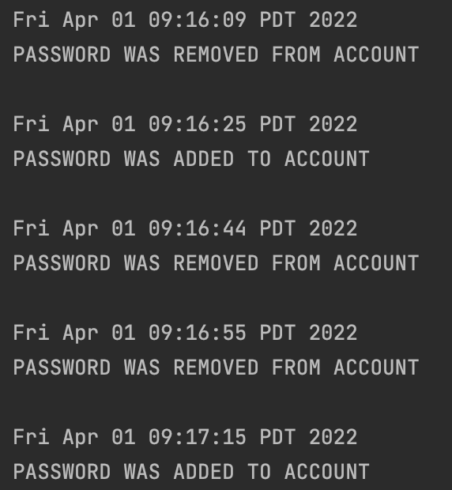

# Password Manager

### Application functionality:
The purpose of this project is to provide users with secure and safe way to store their passwords. Security is going
to be accomplished in this application by requiring users to gain access to their passwords with an account. An 
account is going to be comprised of an email, username and password (username and password is going to be required at
login). The password manager is aimed towards
pretty much anybody who would like to store their passwords for reminding. This project is of interest to me because
I want to be able to store my passwords in a secure location.

Some features include:
- Adding a new password
- Testing the strength of a password
- Encrypting passwords
- Allowing for multiple users

### User stories:
#### Phase 1
- As a user, I want to be able to create a new account
- As a user, I want to be able to add a new password to my account
- As a user, I want to remove a password from my account
- As a user, I want to be able to view all my passwords
#### Phase 2
- As a user, I want to be able to save my passwords to my account when I quit the application
- As a user, I want to be able to load my passwords when I log into my account
### Phase 3
- As a user, I want to be able to create a new account

### Phase 4: Task 2

### Phase 4: Task 3
If I had more time to refactor the design of my project, I would:
- Create a separate file that stores each user's id and username in a map
  - this would be a for more efficient method for obtaining login details rather going through each file in the users 
directory
  - using a map to store all usernames and id's will prevent against duplicated usernames
  - This implementation would also allow a user to have a username that is a substring of another user
- Reduce coupling by implementing the observer pattern
  - this can be accomplished by making the User the subject and the UserWindow, SaveUser, and EventLog classes the 
observer
    - this would prompt each addition or removal of a password to display the changes in the GUI, automatically save 
what was changed, and log the event!
